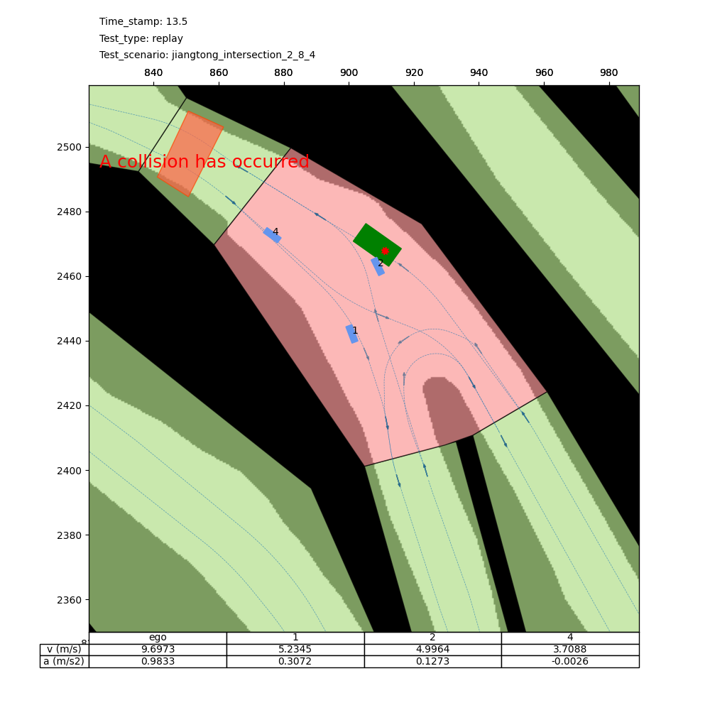
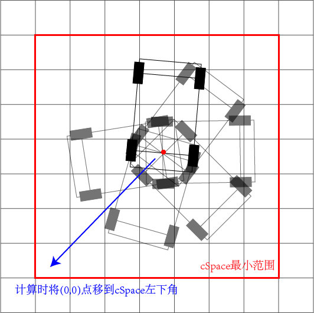

# Vehicle-Collision-Detection-in-Grid-Map

一种栅格图中车辆碰撞检测原理介绍,Introduction to the Principle of Vehicle Collision Detection in a Grid Map

主车与可行驶区域的碰撞检测采用一种基于网格的离散化碰撞检测算法，碰撞案例见下图：

原理见：`自车与道路边界进行碰撞检测的代码原理.md`

