# 开发人员

* 吴佳琪,1297338838@qq.com
* 陈志发,2394146329@qq.com;chenzhifa@buaa.edu.cn

# 功能介绍

功能：进行自车与道路边界的碰撞检测

脚本位置：`devkit\dynamic_scenes\lookup.py`

注意：下面所说的栅格索引、坐标定义都是右x上y直角坐标系

# 使用步骤

```python
# 首先创建CollisionLookup对象，其中vehicletype为车辆类型参数，定义在lookup.py的VehicleType类中
lookup = CollisionLookup(vehicletype)
# 定义完lookup对象之后即可进行边界碰撞检测,x,y,yaw为自车当前位姿，map为二维array变量，存储二值化栅格地图，不可行驶区域的值为false
# 如果当前车辆会与地图边界发生碰撞，返回true
x,y,yaw = 0.0,0.0,0.0
map = np.array()
ret = lookup.collision_detection(x,y,yaw,map)
```

# 检测原理

当``CollisionLookup`对象声明时，会随即计算一系列碰撞查找表格，即以车辆定位点为中心，存储在各个航向角下、**各个单元格位置**下，车辆覆盖的栅格相对索引。

查询碰撞时，利用预先存储的相对索引，加上车辆当前在栅格地图中的实际索引，可以得到车辆覆盖的地图栅格的所有索引。

**注意：**

* 这里的单元格位置指的是把栅格地图的栅格继续细分，如栅格地图的单元格长度是1m，我们在碰撞检测中，可以把栅格边长继续十等分，那么我们就要记录车辆在单元格中10×10=100个不同位置上，所覆盖的周围的单元格都有哪些。

## 检测步骤示例：

1. 把栅格边长二等分，那么车辆在5°航向角，单元格（0,1）位置时，计算出覆盖到的相对索引：图中红色为定位点，灰色为车辆覆盖范围，橙色为定位点所在栅格，该栅格被四等分，定位点在该栅格的（0,1）位置

   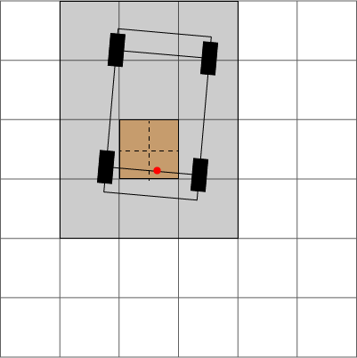

2. 以5°为步长，车辆航向角可以离散为72个，如果按照第一步中将栅格边长二等分，那么栅格中有四个位置，即我们要计算72×4=288个覆盖坐标表格

3. 假设我们已经计算好了所有的表格，那么如果现在进行碰撞检测时，车的定位点所在的栅格地图索引为（2,3），航向刚好为5°，且车的具体定位点刚好在栅格的（1,0）处，那么就可以利用步骤1中计算得到的表格，把这个表格中记录的所有栅格点都加上实际坐标（2,3），就可以得到车辆覆盖的栅格点在当前栅格地图中的坐标

   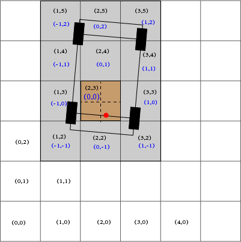

   图示黑色为栅格地图格点的索引，蓝色为车辆覆盖区域的相对索引

4. 有了车辆覆盖的坐标，直接按照这些下标索引，看栅格地图中的值是否为false，就知道车辆是否与边界发生碰撞。（栅格地图中，可行驶区域为true，不可行驶区域为false）

## 代码解析：


- VehicleType类存储不同车辆尺寸信息

### __init__(self, type: VehicleType = VehicleType.MineTruck_XG90G)：

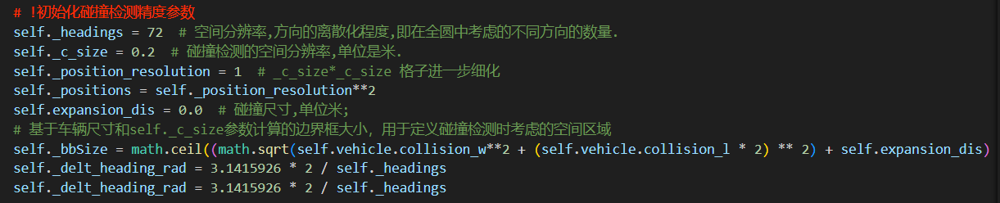

- 上述代码中定义了碰撞检测的参数
  - headings：车辆航向角的离散个数，定义为72，说明离散的步长为5°
  - c_size：栅格地图的单元格边长
  - position_resolution：单元格边长的等分个数，表示上述栅格地图单元格进一步细化的程度，如果值是2就是单元格边长二等分，即单元格面积四等分。
  - positions：单元格面积的等分数量
  - expansion_dis：碰撞的膨胀
  - bbsize：用于定义cSpace的边长，使cSpace能保证不论车辆绕定位点如何转动，都可以使车辆在这个空间里；因此计算时使用了最长对角线的长度加上膨胀距离
  - `delt_heading_rad`：车辆航向角离散的步长

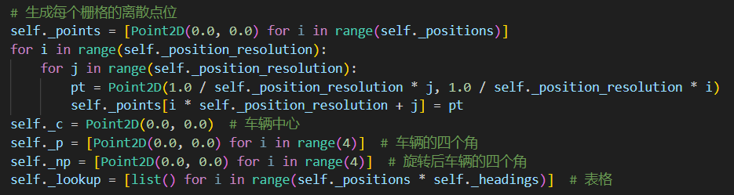

- 上述代码定义了碰撞查询表格
  - 首先，`self.points`为一维列表，记录了细化后单元格中每个子格点左下角的坐标，且记录顺序为从（0,0）位置开始，按行从左到右，从下到上记录。如对下面这个细分后的单元格，self.points为：[(0,0),(0.5,0),(0,0.5),(0.5,0.5)]
  - **注意**：上述列表中的数据为索引值，不是坐标值，计算中并没有用到单元格长度
  - `self._lookup`就是碰撞查询表格，定义为一个二维列表，子列表用于存储车辆覆盖的索引信息，子列表个数由车辆航向角的离散数量和单元格的离散数量决定

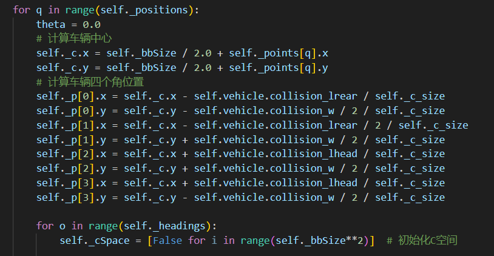

- 外层遍历离散的单元格，内层遍历离散的航向角，q为位置的索引，顺序依然是从左到右，从下到上；o为航向角的索引

- 对于每个离散位置，将车辆的中心向坐标系的第一象限偏移，后边用到的cSpace会存储车辆是否覆盖单元格，类似于二值化地图，cSpace的索引和计算的车辆位置的索引是一致的，因此需要把车辆位置索引设置为正值；然后再计算车辆的四个角点坐标·

  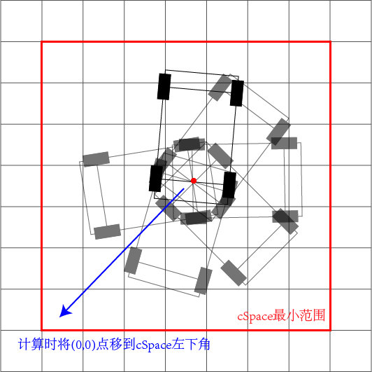

- **注意：上述车辆中心和角点都是所在栅格位置的索引，没有单位，不是具体坐标**

- `self._cSpace`为以bbsize为边长的正方形，定义了车辆覆盖区的范围，能保证不论车辆绕定位点如何转动，都可以使车辆在这个空间里

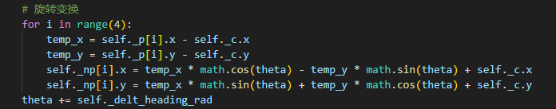

- 计算车辆在当前航向角时，四个角点的位置，这里依然是索引值，不是距离
- 下一步使用直线扫描算法计算出车辆轮廓覆盖的单元格，并将对应的cSpace元素置为true
- 接着按行遍历，填充两个轮廓之间的单元格，将对应的cSpace元素置为true

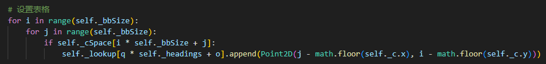

- 将一个cSpace更新完成之后，根据cSpace中记录的覆盖数据（cSpace的索引全是正值），将对应的索引更新到lookup表格中，并将索引中心重新移回原点
- 注意：lookup是二维的列表，外层循环车辆位置和航向，内层是车辆覆盖的所有单元格对应的索引；外层按照优先位置，再航向的顺序进行存储

### collision_detection(self, x: float, y: float, yaw: float, image):

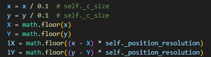

- X,Y是车辆位置对应的单元格的索引，x，y也可以看成单元格索引，只不过有小数部分，可以看成到原点有x个单元格
- 那么x-X就是车辆比单元格左侧边界的位置多出来了多少单元格，如果x-X=0.5，就是车辆的实际位置比当前格点左侧边界超出了0.5个单元格
- iX，iY是车辆坐标对应的单元格内部的位置，比如如果把单元格十等分，那么上述超出0.5个单元格，就是说车辆在单元格内部细分的第五个格点。这个可以用来索引车辆位置，对应表格生成时的q。

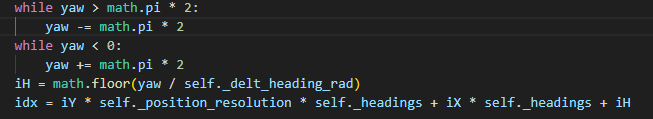

- 和上边一步相似，这里计算了离散的yaw角，对应表格生成时的o
- 最后计算了idx，也就是lookup的索引，按照生成时存储的顺序，先位置（对于位置，先左后右，先下后上），再航向
- 有了lookup索引之后，就知道了车辆在当前姿态下，所有覆盖到的栅格点的相对索引，

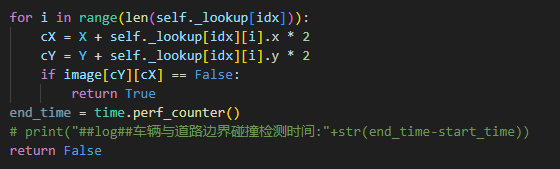

- 将覆盖位置的相对索引与车辆位置的实际索引相加，可以得到覆盖位置的实际索引，然后在栅格地图中查找对应的栅格是否为不可行驶区域，就知道了是否碰撞。

### 直线扫描算法

根据车辆四个角点，生成四个搜索的向量。

从一个向量的起点开始，就是一个覆盖到的点，然后向向量的终点走，按照移动方向，x和y每一步最多只能变化一个单位。

一般对于一条向量，x和y移动的距离是不一样的，因此每个单元格占x和y的比例也是不一样的。

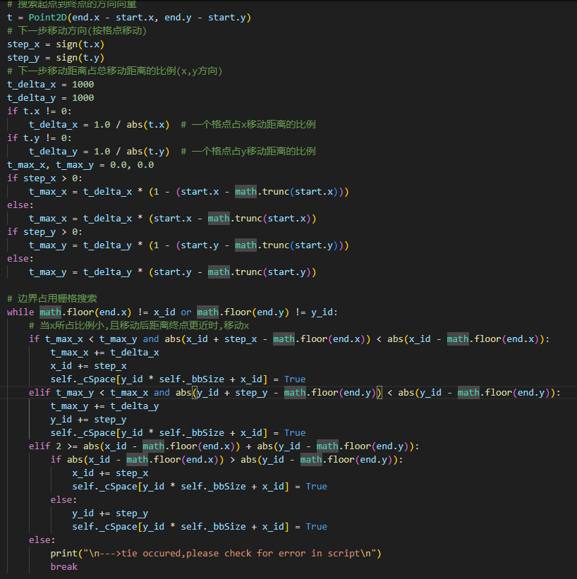

- 在这里主要维护两个变量：t_max_x和t_max_y：表示如果下一步移动x（y），已经走过的距离占x(y)移动距离的比例。

- 下一步移动哪个方向，取决于哪个方向当前占总比例更小

- 如果接近终点时，判断依据就由走过的距离所占比例换成到终点的距离所占的比例。

  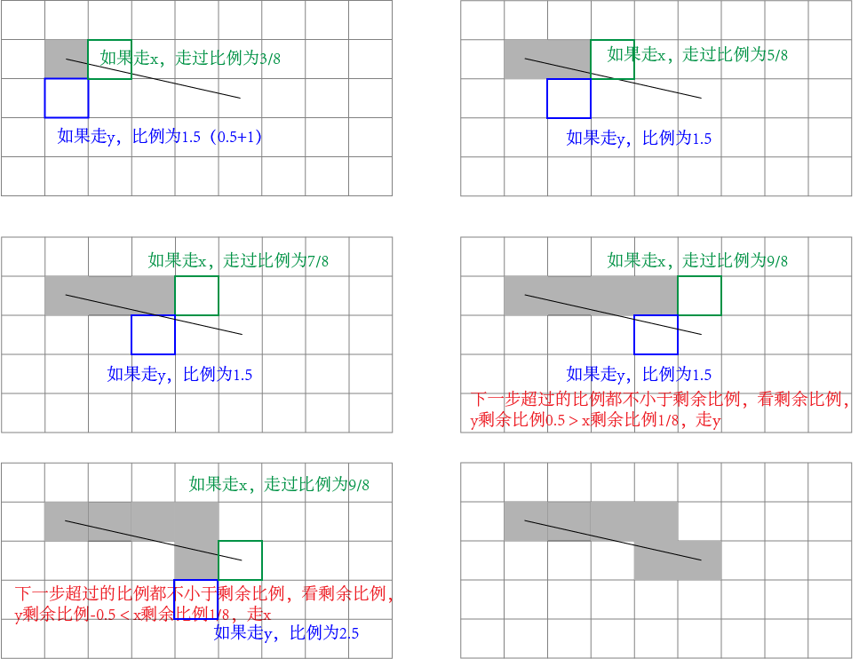

# 参考资料

1. Kurzer K. Path Planning in Unstructured Environments : A Real-time Hybrid A* Implementation for Fast and Deterministic Path Generation for the KTH Research Concept Vehicle[D/OL]. Sweden: Kungliga Tekniska Högskolan, 2016 .

   > - https://gitcode.com/karlkurzer/path_planner/overview
   > - 主要参考了该代码仓库：https://gitcode.com/karlkurzer/path_planner/blob/master/include/lookup.h

2. Ericson C. Real-time collision detection[M/OL]. Crc Press, 2004.[get pdf:https://github.com/imgaray/EPD/blob/master/doc/Real-Time%20Collision%20Detection.pdf]
